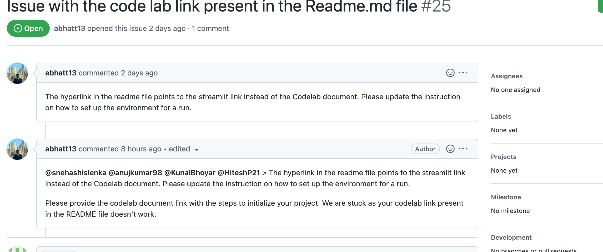
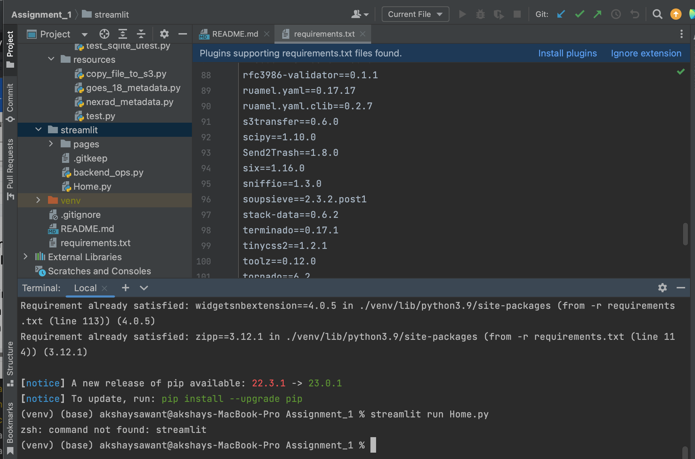
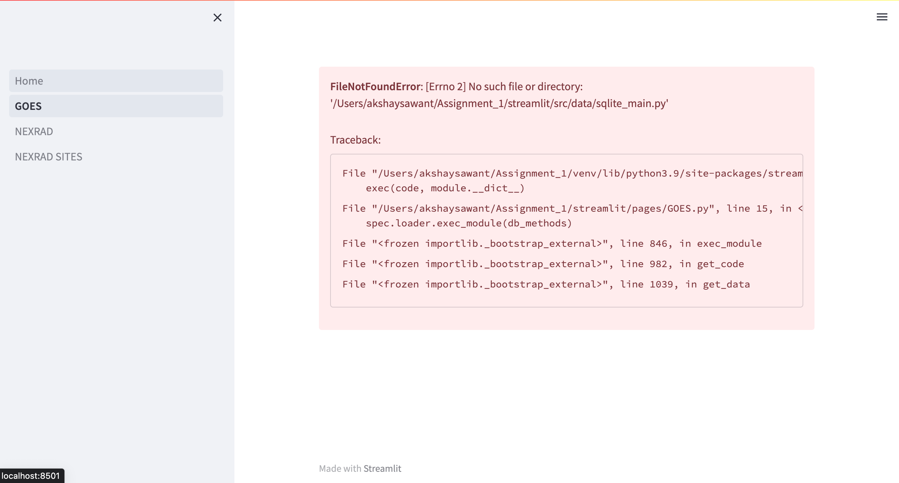
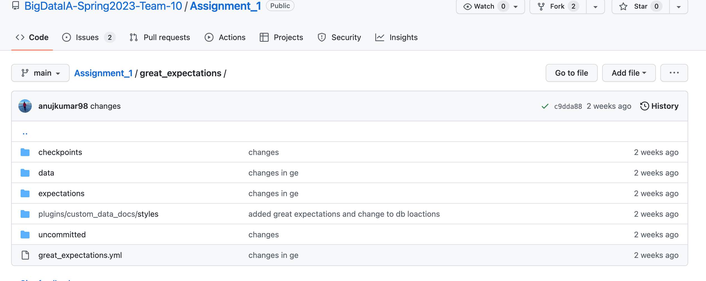

# **🐞 Bug Report**

## **Describe the bug**

<!-- A clear and concise description of what the bug is. -->
* The hyperlink to the codelabs on the Readme.md file does not work.
* Requirements.txt file missing Streamlit import
* After Running Streamlit application it gives an error that the some file is missing.
* Codelabs with no proper instructions
* No README.md file for great expectations implementation. Along with only one .json file in expectations. 
-   ***

### **Is this a regression?**

<!-- Did this behaviour used to work in the previous version? -->
<!-- Yes, the last version in which this bug was not present was: ... -->
* Codelabs link would possibly not be a version issue
* Requirements.txt must be missing a few imports
* Streamlit application not running properly might be an issue with the version as the app ran in their system. 
---

### **To Reproduce**

 Steps to reproduce the error:
1. For codelabs: Go to the git repository and try to click on the link provided.(You wont see the colab open)
2. For Requirements.txt error: clone the repo, open the file, activate the virtual environment, pip install -r requirements.txt, try to run streamlit run Home.py (No such command Streamlit)
3. run the app after following the instructions in 2 and then install streamlit and run the app (missing file)
4. Check codelabs file.
5. Check the great expectations folder to check for Readme.md and expectations folder for single .json file.

---

### **Expected behavior**

<!-- A clear and concise description of what you expected to happen. -->

* Open the codelabs documentation 
* Smoothly run the streamlit command
* App to open without any error
* Have proper instruction
* Instructions for implementing great expectations. Both .json files for expectation generation.
-   ***

### **Media prove**

<!-- If applicable, add screenshots or videos to help explain your problem. -->

<!-- <imag src="codelab.png" width="300" height="300" /> -->

   

<!-- <imag src="require.png" width="300" height="300" /> -->

   

<!-- <imag src="App_error.png" width="300" height="300" /> -->

   

<!-- <imag src="labcode.png" width="300" height="300" /> -->

   

<!-- <imag src="read.png" width="300" height="300" /> -->

   
---

### **Your environment**

<!-- use all the applicable bulleted list elements for this specific issue,
and remove all the bulleted list elements that are not relevant for this issue. -->

-   OS: Mac <!--[e.g. Ubuntu 5.4.0-26-generic x86_64 / Windows 1904 ...]-->
-   Python Version:3.9.12

---

<!--📛📛📛📛📛📛📛📛📛📛📛📛📛📛📛📛📛📛📛📛📛📛📛📛📛📛📛📛📛📛

Oh, hi there! 😄

To expedite issue processing, please search open and closed issues before submitting a new one.

📛📛📛📛📛📛📛📛📛📛📛📛📛📛📛📛📛📛📛📛📛📛📛📛📛📛📛📛📛📛📛📛-->
